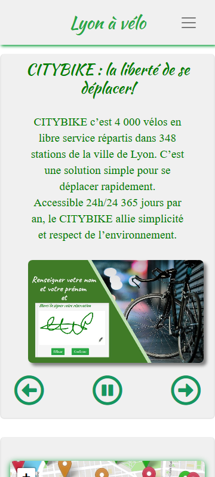

URL: https://anetalaurent.github.io/project3/
  

DESCRIPTIF

Projet réalisé dans le cadre de la formation DWJ de Openclassrooms.
L'objectif était de  développer une page de type "Single page Application" simulant la réservation de vélos dans une ville de Lyon.
Il dispose des caractéristiques suivantes :

    1. L'application repose entièrement sur du pur code JAVASCRIPT (aucune utilisation de JQUERY).
    2. Elle permet d'exploiter des données en provenance de l'API "JC Decaux".
    3. Le code a été entièrement revu et corrigé en POO 
    4. Aucun plugin n’est utilisé pour la logique de l’application (Diaporama, Canvas, Carte)

